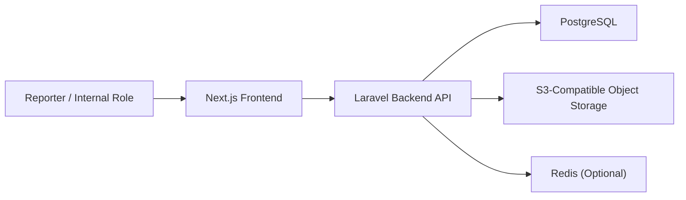
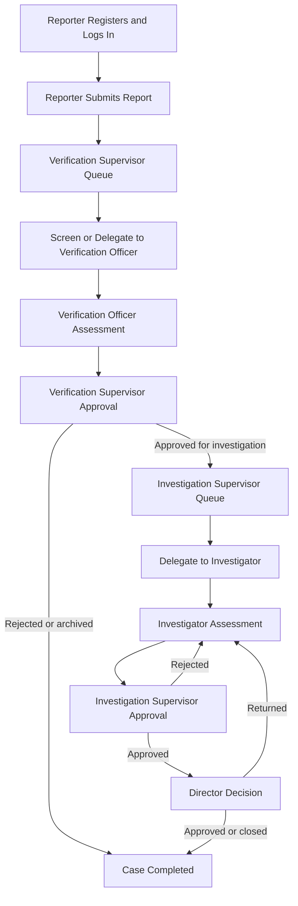

# Architecture Notes

## Thesis Orientation

This prototype treats whistleblowing as a governance capability, not only a submission form. The current architecture emphasizes:

- registered reporter ownership before submission
- confidential handling of all reporter data
- anonymous versus identified reporting mode at the case-handling layer
- segregation of duties across verification, investigation, approval, and administration
- auditability of every workflow transition
- measurable governance and queue oversight

Terminology note:
- `Reporter` is the user-facing term for the whistleblower account
- the modeled business process is inspired by current KPK practice
- the visible labels remain English and governance-oriented, for example `Verification Supervisor`, `Verification Officer`, `Investigation Supervisor`, and `Investigator`

## Modular Structure

Storage note:
- local development uses MinIO
- production can use DigitalOcean Spaces or another S3-compatible provider

## Frontend Modules

- public landing and institutional content
- reporter authentication and profile
- reporter report directory at `/submit`
- dedicated report create and edit pages
- public-safe tracking at `/track`
- workflow queue at `/workflow`
- approval queue at `/workflow/approvals`
- dedicated workflow execution and approval pages
- system administrator workspace at `/admin`
- governance dashboard

## Backend Modules

- Sanctum-based authentication and role enforcement
- reporter-owned report intake and update
- workflow orchestration for screening, verification, investigation, and final approval
- paginated workflow and administration directories
- private attachment management backed by S3-compatible storage
- audit logging and timeline events
- governance dashboard aggregation

## KPK-Inspired Role-Based Process Modeled

## Current Workflow Capture Model

### Reporter

The reporter submission model currently captures:

- `title`
- `description`
- `reported_parties[]`
- `attachments[]`

Each reported party records:

- full name
- position
- classification

### Verification Supervisor

The first workflow gate captures:

- screening rejection decision
- assignee selection for a verification officer
- delegation note

### Verification Officer

The verification assessment captures:

- information summary
- corruption aspect tags
- authority assessment
- criminal assessment
- reason
- recommendation
- forwarding destination when applicable

### Investigation Supervisor

The investigation delegation gate captures:

- investigator assignee
- assigned unit
- delegation note

### Investigator

The structured investigation record captures:

- case name
- reported parties
- complaint description
- investigation recommendation
- delict
- legal article
- start and end month-year
- city and province
- modus
- related report reference
- authority
- priority
- additional information
- conclusion

### Approval Gates

Verification Supervisor, Investigation Supervisor, and Director each record:

- decision
- approval note
- optional public update

## Core Data Objects

- `users`: reporter and internal role accounts
- `reports`: reporter-owned allegations, public reference, tracking token, status, encrypted reporter snapshot, and `reported_parties`
- `report_attachments`: attachment metadata linked to object storage keys
- `case_files`: workflow stage, assignees, SLA, confidentiality mode, completion state, and structured workflow payloads
- `case_timeline_events`: public and internal lifecycle events
- `audit_logs`: immutable records of submission, delegation, approval, rejection, forwarding, archival, and completion
- `governance_controls`: governance catalogue for dashboard reporting
- `personal_access_tokens`: authenticated API access tokens

## Identity Handling

- `anonymous`: reporter identity remains confidential in storage and is not disclosed to internal case handlers
- `identified`: reporter identity remains confidential in storage but is visible to authorized internal case handlers
- in both modes, the reporter still owns the report and can access it through the authenticated reporter workspace

## Infrastructure Position

- PostgreSQL runs natively on the host for direct thesis analysis
- MinIO runs through Docker for local S3-compatible attachment storage
- Redis remains optional for development
