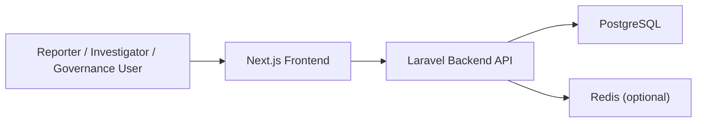

# Architecture Notes

## Thesis Orientation

This prototype frames whistleblowing as a governance capability rather than only a complaint form. The architecture therefore emphasises:

- confidentiality and controlled disclosure
- traceability through audit events
- segregation of duties between intake, investigation, and oversight
- measurable governance controls and SLA posture

## Modular Structure

## Frontend Modules

- submission journey for protected intake
- public case tracking with reference and token
- investigator workspace for queue visibility
- governance dashboard for control monitoring

## Backend Modules

- report intake and validation
- case workflow orchestration
- governance control catalogue
- audit logging
- dashboard aggregation and metrics

## Core Data Objects

- `reports`: public reference, tracking token, allegation details, severity, status
- `case_files`: internal case ownership, stage, SLA, escalation state
- `case_timeline_events`: public and internal timeline entries
- `audit_logs`: immutable-style workflow event log
- `governance_controls`: control catalogue for dashboard visibility

## Governance Controls Represented

- anonymity safeguard
- segregation of duties
- triage timeliness
- audit trail completeness

## KPK-Inspired Elements

The prototype borrows the public-facing pattern of:

- direct report submission
- reference-based tracking
- a serious institutional tone for integrity reporting

It then adds thesis-specific governance views and modular boundaries that are not just presentational.
