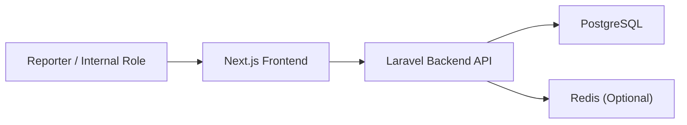
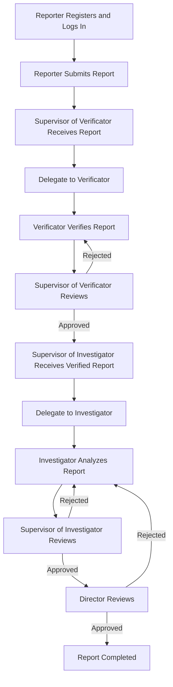

# Architecture Notes

## Thesis Orientation

This prototype treats whistleblowing as a governance capability rather than a standalone submission form. The architecture therefore emphasizes:

- reporter registration before intake
- confidentiality with controlled public disclosure
- segregation of duties across verification, investigation, and approval
- traceability through audit events
- measurable governance controls and queue metrics

## Modular Structure

## Frontend Modules

- reporter registration and login
- reporter submission workspace
- public tracking workspace
- internal workflow workspace
- governance dashboard
- system administrator workspace

## Backend Modules

- authentication and role enforcement
- report intake with authenticated reporter ownership
- workflow orchestration for verification and investigation
- director approval routing
- user provisioning for internal roles
- audit logging and governance metrics

## KPK Role-Based Process Modeled

## Core Data Objects

- `users`: reporter and internal role accounts
- `reports`: reporter-owned allegations, public reference, tracking token, severity, status
- `case_files`: internal workflow routing, current role, assignments, SLA, and completion state
- `case_timeline_events`: public and internal timeline events
- `audit_logs`: workflow evidence for submission, delegation, approval, rejection, and completion
- `governance_controls`: explicit governance control catalogue for dashboard reporting
- `personal_access_tokens`: bearer tokens for authenticated API use

## Governance Controls Represented

- reporter registration control
- confidentiality handling
- segregation of duties
- workflow timeliness
- audit trail completeness

## Infrastructure Position

The operational database runs on local PostgreSQL to support thesis analysis directly from the host environment. Docker is retained only for optional services such as Redis.
