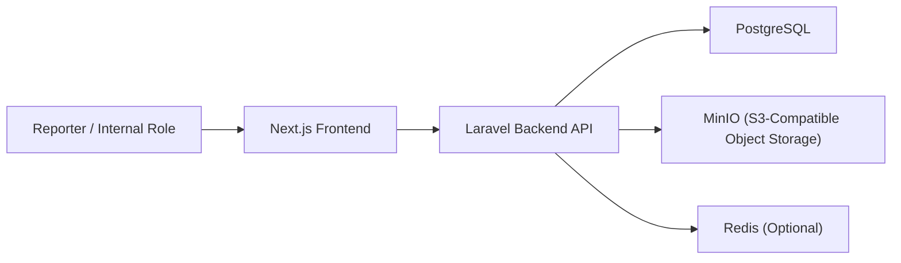
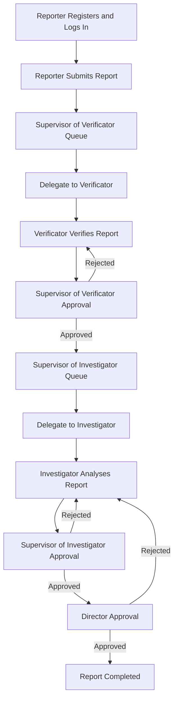

# Architecture Notes

## Thesis Orientation

This prototype treats whistleblowing as a governance capability, not only a submission form. The current architecture emphasizes:

- registered reporter ownership before submission
- confidential handling of all reporter data
- anonymous versus identified reporting mode at the case-handling layer
- segregation of duties across verification, investigation, and approval
- auditability of every workflow transition
- measurable governance and queue oversight

## Modular Structure

## Frontend Modules

- public landing and institutional content
- reporter authentication and profile
- reporter report directory at `/submit`
- dedicated report create and edit pages
- public-safe tracking at `/track`
- workflow queue at `/workflow`
- approval queue at `/workflow/approvals`
- dedicated workflow execution and approval pages
- system administrator workspace at `/admin`
- governance dashboard

## Backend Modules

- Sanctum-based authentication and role enforcement
- reporter-owned report intake and update
- workflow orchestration for verification, investigation, and final approval
- paginated workflow and administration directories
- private attachment management backed by MinIO
- audit logging and timeline events
- governance dashboard aggregation

## KPK Role-Based Process Modeled

## Core Data Objects

- `users`: reporter and internal role accounts
- `reports`: reporter-owned allegations, public reference, tracking token, status, and encrypted reporter snapshot
- `report_attachments`: attachment metadata linked to object storage keys
- `case_files`: workflow stage, assignees, SLA, confidentiality mode, and completion state
- `case_timeline_events`: public and internal lifecycle events
- `audit_logs`: immutable records of submission, delegation, approval, rejection, and completion
- `governance_controls`: governance catalogue for dashboard reporting
- `personal_access_tokens`: authenticated API access tokens

## Identity Handling

- `anonymous`: reporter identity remains confidential in storage and is not disclosed to internal case handlers
- `identified`: reporter identity remains confidential in storage but is visible to authorized internal case handlers
- in both modes, the reporter still owns the report and can access it through the authenticated reporter workspace

## Infrastructure Position

- PostgreSQL runs natively on the host for direct thesis analysis
- MinIO runs through Docker for local S3-compatible attachment storage
- Redis remains optional for development
